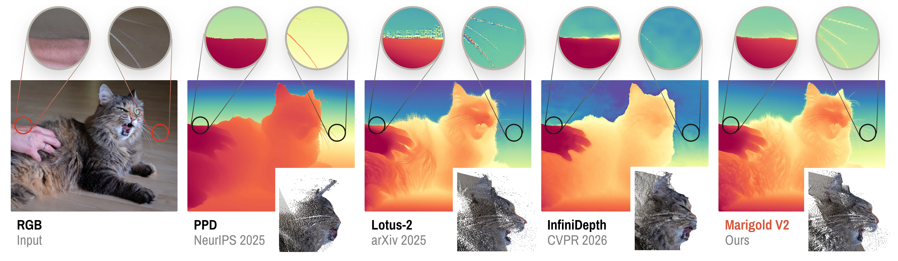

<div align="center">
<h1>Marigold V2</h1>
<h3>Revisiting Diffusion Transformers for Monocular Depth Estimation</h3>
</div>

<div align="center">
  ACM Transactions on Graphics (SIGGRAPH Asia 2026)<br><br>
  Igor Pavlovic<sup>1,2,*,†</sup>, Thiemo Wandel<sup>2,*</sup>, Anton Obukhov<sup>2,§</sup><br>
  Luca Bartolomei<sup>3</sup>, Andrey Davydov<sup>2</sup>, Fabio Tosi<sup>3</sup>, Matteo Poggi<sup>3</sup>, Sabine Süsstrunk<sup>1</sup>, Dengxin Dai<sup>2</sup><br><br>
  <sup>1</sup>EPFL · <sup>2</sup>HUAWEI Bayer Lab · <sup>3</sup>University of Bologna · <sup>*</sup>Equal contribution · <sup>†</sup>Internship · <sup>§</sup>Project lead
</div>

<br>

<p align="center">
  <a href="https://hf.co/spaces/huawei-bayerlab/marigold-v2-web" target="_blank" rel="noopener noreferrer" style="display: inline-block;"></a>&nbsp;
  <a href="https://arxiv.org/abs/2609.08084" target="_blank" rel="noopener noreferrer" style="display: inline-block;"></a>&nbsp;
  <a href="https://huggingface.co/spaces/toshas/Marigold-V2" target="_blank" rel="noopener noreferrer" style="display: inline-block;"></a>&nbsp;
  <a href="https://huggingface.co/huawei-bayerlab/marigold-v2-0" target="_blank" rel="noopener noreferrer" style="display: inline-block;"></a>&nbsp;
  <a href="https://twitter.com/antonobukhov1" target="_blank" rel="noopener noreferrer" style="display: inline-block;"></a>
</p>

---

Marigold V2 is a family of models and a cost-effective fine-tuning protocol
that repurposes a pretrained diffusion transformer into single-step dense
predictors: depth, see-through depth, surface normals, albedo, and other dense
modalities. Fine-tuning takes less than a week on a single consumer GPU, within
reach of individual practitioners and small labs, and the results are state of
the art, faithfully reproducing sharp edges, fur, and hair-thin details. The
same models also unlock applications such as metric depth completion.

<div align="center">
  
</div>

This repository contains inference, evaluation, and training code, plus the
configs of every released checkpoint.

- [News](#news)
- [Quick start](#quick-start)
- [Checkpoints](#checkpoints)
- [Inference](#inference)
- [Evaluation](#evaluation)
- [Training](#training)
- [Extending to a new task](#extending-to-a-new-task)
- [Repository layout](#repository-layout)
- [Checklist](#checklist)
- [Troubleshooting](#troubleshooting)
- [Contributing](#contributing)
- [Citation](#citation)

## News

2026-12: To appear in ACM Transactions on Graphics 45(6) and to be presented at
SIGGRAPH Asia 2026.<br>
2026-09-13: Mirrored on ModelScope:
<sub><a href="https://www.modelscope.cn/studios/huawei-bayerlab/marigold-v2-web" target="_blank" rel="noopener noreferrer"></a>
<a href="https://www.modelscope.cn/models/huawei-bayerlab/marigold-v2-0" target="_blank" rel="noopener noreferrer"></a>
<a href="https://www.modelscope.cn/studios/huawei-bayerlab/Marigold-V2" target="_blank" rel="noopener noreferrer"></a></sub><br>
2026-09-08: Initial release: inference, evaluation, and training code, the released
checkpoints, and the demo.<br>

## Quick start

Requirements: Linux, Python 3.10, a CUDA GPU. Inference at 1024² needs about
17 GB of GPU memory and 2048² about 29 GB; the DiT is quantized to 4 bit when it
is first loaded, which takes a few minutes.

```bash
git clone https://github.com/huawei-bayerlab/marigold-v2.git
cd marigold-v2
bash setup/setup_env.sh            # conda env "marigold-v2", CUDA 12.8 wheels; pass cu126 etc. to change
conda activate marigold-v2

python scripts/download_assets.py --skip-datasets   # Qwen-Image-Edit-2509 + all Marigold V2 checkpoints
python scripts/infer.py --image_dir assets/examples --output_dir output/examples
```

Depth predictions land in `output/examples/images/predictions_npy/` as float32
`.npy` files and in `visualizations/depth_spectral/` as PNGs. Everything the
repository downloads goes to `assets/` (or `$DEPTH_ASSETS_DIR`).

## Checkpoints

All checkpoints share the frozen Qwen-Image-Edit-2509 backbone and are stored as
`trainables.safetensors` (LoRA adapters and, where trained, the VAE decoder) in
[huawei-bayerlab/marigold-v2-0](https://huggingface.co/huawei-bayerlab/marigold-v2-0). The
depth checkpoints differ in how depth is parameterized before it enters the VAE
and in the training stage.

| Checkpoint | Output | Training | Config |
|---|---|---|---|
| `depth/Log-stage2` (default) | affine-invariant log depth | Stage 1 → Stage 2 (SinkLoss, VAE decoder fine-tuned). The paper model. | `training_relative_log_depth_config_stage2.yaml` |
| `depth/Log-stage1` | affine-invariant log depth | Stage 1 only: latent MSE + L1 + gradient + iREPA, 160k steps. Initialization for Stage 2 and layered fine-tuning. | `training_relative_log_depth_config.yaml` |
| `depth/Log-layered` | see-through log depth | `Log-stage1` fine-tuned with SinkLoss on layer 8 of LayeredDepth-Syn: predicts geometry behind glass. | `training_relative_log_depth_layered_config.yaml` |
| `depth/Uniform-base` | affine-invariant linear depth (Marigold V1 style) | Stage 1 recipe, 30k steps. Parameterization ablation. | `training_relative_config.yaml` |
| `depth/Disparity-base` | affine-invariant inverse depth | Stage 1 recipe with VAE decoder fine-tuning, 30k steps. Parameterization ablation. | `training_relative_disp_config.yaml` |
| `depth/Disparity-layered` | see-through inverse depth | Stage 1 recipe on layer 8 of LayeredDepth-Syn. | `training_relative_disp_layered_config.yaml` |
| `depth/Uniform-layered` | see-through linear depth | LayeredDepth-Syn variant of `Uniform-base`. | not included |
| `normals` | camera-space unit normals | angular loss + iREPA + SinkLoss, VAE decoder fine-tuned, 30k steps | `training_normals.yaml` |
| `albedo` | linear RGB albedo in [0, 1] | L1 + iREPA, VAE decoder fine-tuned, 30k steps | `training_albedo.yaml` |

Depth configs live in `marigoldv2/experiments/20260316_qwen_depth/`, the normals
and albedo configs in `marigoldv2/experiments/20260728_qwen_normals/` and
`marigoldv2/experiments/20260803_qwen_albedo/`. Log and linear depth increase
with distance, disparity decreases; the values are affine-invariant, i.e. up to
an unknown scale and shift per image.

The precomputed Qwen text-prompt embeddings under
`Marigold-V2/qwen_text_embeddings/` replace the text encoder at inference and
training time, so the 7B text encoder is never loaded.

## Inference

```bash
python scripts/infer.py --modality depth   --image_dir /path/to/images --output_dir output/depth
python scripts/infer.py --modality normals --image_dir /path/to/images --output_dir output/normals
python scripts/infer.py --modality albedo  --image_dir /path/to/images --output_dir output/albedo
```

| Flag | Meaning |
|---|---|
| `--modality` | `depth` (default), `normals`, or `albedo`; selects the default checkpoint and prompt embedding |
| `--checkpoint` | checkpoint directory or Hugging Face `repo[/subfolder]`, e.g. `assets/checkpoints/Marigold-V2/depth/Log-layered` |
| `--width`, `--height` | run at a fixed resolution instead of the native one (rounded up to a multiple of 16) |
| `--seed` | seed for the VAE encoder sampling (default 2025) |

Outputs mirror the input folder structure under `<output_dir>/images/`:
`predictions_npy/*.npy` (depth: `[H, W]`; normals and albedo: `[3, H, W]`) and
`visualizations/<modality>/*.png`. Predictions are resized back to the input
resolution.

## Evaluation

Download the depth and surface-normal benchmarks separately using the instructions
below; `scripts/download_assets.py` does not download these evaluation datasets.
Run these commands from the repository root. They use `assets/` by default, or
`$DEPTH_ASSETS_DIR` when set, matching the evaluation launchers.

For **depth** estimation, download the
[Marigold evaluation datasets](https://share.phys.ethz.ch/~pf/bingkedata/marigold/evaluation_dataset/)
and extract each tar archive into its containing directory:

```bash
(
  set -e
  mkdir -p "${DEPTH_ASSETS_DIR:-assets}/datasets/marigold_depth_eval"
  cd "${DEPTH_ASSETS_DIR:-assets}/datasets/marigold_depth_eval"
  wget -r -np -nH --cut-dirs=4 -R "index.html*" -P . https://share.phys.ethz.ch/~pf/bingkedata/marigold/evaluation_dataset/
  find . -type f -name '*.tar' -print0 | while IFS= read -r -d '' archive; do
    tar -xf "$archive" -C "$(dirname "$archive")"
  done
)
```

For **normal** estimation, create the destination directory and download the
official Marigold evaluation archive:

```bash
NORMALS_ROOT="${DEPTH_ASSETS_DIR:-assets}/datasets/marigold_normals_eval"
mkdir -p "$NORMALS_ROOT"
(
  set -e
  cd "$NORMALS_ROOT"
  wget -O evaluation_dataset.zip \
    https://share.phys.ethz.ch/~pf/bingkedata/marigold/marigold_normals/evaluation_dataset.zip
  unzip -n evaluation_dataset.zip
)
```

Download the preprocessed Sintel benchmark separately into the same directory,
then extract it:

```bash
(
  set -e
  cd "$NORMALS_ROOT"
  wget -O sintel.zip \
    https://share.phys.ethz.ch/~pf/bingkedata/marigold/marigold_normals/sintel.zip
  unzip -n sintel.zip
)
```

Both archives should extract directly under `marigold_normals_eval/`; do not
add another enclosing directory. The dataset directories must sit directly
under the benchmark root as shown below (downloaded archives can remain):

```text
assets/                         # or $DEPTH_ASSETS_DIR
└── datasets/
    ├── marigold_depth_eval/
    │   ├── diode/
    │   ├── eth3d/
    │   ├── kitti/
    │   ├── nyuv2/
    │   └── scannet/
    └── marigold_normals_eval/
        ├── ibims/ibims/
        ├── nyuv2/test/
        ├── scannet/
        └── sintel/
```

Each launcher below writes predictions and metrics under `output/eval_runs/` and
prints where. Add `MAX_SAMPLES` as the second argument to any launcher for a
quick partial run.

**Zero-shot depth** on NYUv2, KITTI, ETH3D, ScanNet, and DIODE with the
Pixel-Perfect Depth protocol (RANSAC alignment in log space, native resolution;
ETH3D is upsampled to 2048×1360 before scoring):

```bash
bash evaluation/depth/run_infer_and_eval.sh                       # Log-stage2, all datasets
bash evaluation/depth/run_infer_and_eval.sh <checkpoint> "" 1 evaluation/config/inference_depth.yaml kitti,eth3d
bash evaluation/depth/run_eval_from_preds.sh output/eval_runs/depth_<stamp>/predictions   # rescore existing predictions
```

| | NYUv2 | KITTI | ETH3D | ScanNet | DIODE |
|---|---|---|---|---|---|
| AbsRel ↓ / δ1 ↑ | 3.6 / 98.0 | 5.4 / 97.4 | 2.8 / 99.2 | 3.7 / 97.9 | 5.2 / 97.1 |

**Soft Edge Error** on the Hypersim test split at native resolution. Needs the
Hypersim training data:

```bash
python scripts/download_assets.py
bash evaluation/depth_see/run_hypersim_origres_edge_eval.sh        # SEE_1,3,5,7; paper: 0.352 / 0.333 / 0.320 for k = 3, 5, 7
```

**Surface normals** on NYUv2, ScanNet, iBims-1, and Sintel:

```bash
bash evaluation/normals/run_qwen_normals_infer_and_eval.sh        # mean angular error / % within 11.25°
```

| | NYUv2 | ScanNet | iBims-1 | Sintel |
|---|---|---|---|---|
| mean err ↓ / 11.25° ↑ | 16.6 / 61.2 | 14.1 / 67.4 | 15.9 / 70.9 | 28.7 / 27.6 |

The Hypersim normals edge metric (SAEE) needs the Hypersim normals dataset:
```bash
python scripts/download_assets.py
bash scripts/hypersim_normals/download_and_preprocess_hypersim_normals.sh
bash evaluation/normals_saee/run_hypersim_normals_origres_edge_eval.sh
```

**Albedo** on the Hypersim IID test split needs the Hypersim albedo dataset; expected PSNR 20.78, SSIM 0.811, LPIPS 0.195:

```bash
python scripts/download_assets.py
bash scripts/hypersim_albedo/download_and_preprocess_hypersim_albedo.sh
bash evaluation/albedo/run_qwen_albedo_infer.sh assets/checkpoints/Marigold-V2/albedo output/eval_runs/albedo
bash evaluation/albedo/run_qwen_albedo_eval.sh output/eval_runs/albedo/hypersim_test_albedo_qwen_native output/eval_runs/albedo/metrics
```

## Training

All released models were trained on a single 32 GB GPU with batch size 1.
Stage 1 of the depth model (160k steps) takes about five days, every other
config (30k steps) about one day.

**Data.** Depth trains on Hypersim and Virtual KITTI 2 as repackaged for
Marigold V1; iREPA needs DINOv3, which is gated on Hugging Face (accept the
terms on the [model page](https://huggingface.co/facebook/dinov3-vitb16-pretrain-lvd1689m),
then `hf auth login`):

```bash
python scripts/download_assets.py --include-dinov3          # checkpoints, DINOv3, and training data
python scripts/download_assets.py --include-layereddepth-syn --skip-checkpoints   # optional; downloads and prepares LayeredDepth-Syn
bash scripts/hypersim_normals/download_and_preprocess_hypersim_normals.sh          # optional, ~1.2 TB, for normals
bash scripts/hypersim_albedo/download_and_preprocess_hypersim_albedo.sh            # optional, ~500 GB, for albedo
```

The two Hypersim scripts run the Marigold V1.1 preprocessors scene by scene and
resume after interruption; see their READMEs under `scripts/`.

**Reproducing the depth model.**

```bash
# Stage 1: iREPA + pixel losses on Hypersim + vKITTI (160k steps)
python marigoldv2/script/train/train.py \
  --config marigoldv2/experiments/20260316_qwen_depth/training_relative_log_depth_config.yaml \
  --output_dir output/train_runs --no_wandb

# Stage 2: SinkLoss with VAE decoder fine-tuning, initialized from Stage 1 (30k steps)
python marigoldv2/script/train/train.py \
  --config marigoldv2/experiments/20260316_qwen_depth/training_relative_log_depth_config_stage2.yaml \
  --output_dir output/train_runs --no_wandb
```

The Stage 2 config initializes from `assets/checkpoints/Marigold-V2/depth/Log-stage1`;
point `paths.env_paths.checkpoint` at your own Stage 1 run to chain them. Any
other config in the table above trains the same way.

A run writes to `<output_dir>/<config stem>/`: `config.yaml`, a code snapshot,
TensorBoard logs, validation visualizations, and `checkpoint/checkpoint-{best,latest,<step>}/`.
Each checkpoint folder holds `trainables.safetensors`, which is exactly the
format of the released checkpoints, so it can be passed to `scripts/infer.py
--checkpoint` or to any evaluation launcher directly. Resume an interrupted run
with `--resume_run <run>/checkpoint/checkpoint-latest`. Weights & Biases logging
is on unless `--no_wandb` is given; add `--add_datetime_prefix` to keep several
runs of one config apart.

Multi-GPU training uses `accelerate launch --multi_gpu marigoldv2/script/train/train.py ...`;
each GPU keeps the configured per-process batch size, increasing the effective
global batch size. `optimization.gpu_scaling` divides total and periodic step
counts by the number of processes, keeping the number of seen samples approximately
constant.

## Extending to a new task

The training framework is a small registry of building blocks composed by YAML.
A training config declares:

- `base_config`: dataset definition files from `marigoldv2/config/datasets/`. A dataset is a `manifest_graph` (how to list samples), a `transform` list (how to load and augment one sample), and, for validation sets, `validation_steps`.
- `register_modules`: Python modules whose `@register(...)` classes the config may reference.
- `network_components`: loaders that put models into the registry, here the Qwen VAE and the quantized DiT with LoRA.
- `network_graph`: an ordered list of steps that read from and write to the `batch` dict, e.g. encode RGB → one DiT step → decode → pick channels.
- `loss_graph`: losses that read prediction and target keys from the batch.
- `optimization`: schedule, quantization, and LoRA settings.

The surface-normal experiment is the smallest complete example of a new task,
in `marigoldv2/experiments/20260728_qwen_normals/`: `data.py` adds a manifest
loader and normal-aware transforms, `network_graph.py` adds one output step
that turns the decoded RGB into unit normals, `loss.py` adds the angular loss,
`validation.py` adds metrics and visualizations, and `training_normals.yaml`
wires them together with the shared depth blocks. The albedo experiment follows
the same pattern.

To add a task: copy a dataset YAML and adapt its manifest loader and
transforms; write the output step, loss, and validation steps in a new
experiment folder; list the new modules under `register_modules`; then run a
short training with `--output_dir output/debug`. For inference on plain image
folders, add an output adapter to `marigoldv2/validation/folder_steps.py` and a
`MODALITIES` entry in `scripts/infer.py`.

## Repository layout

```
setup/setup_env.sh       creates the conda environment and installs the package
scripts/                 infer.py (inference on image folders), download_assets.py, Hypersim dataset builders
marigoldv2/              training framework: core registry, datasets, losses, trainer, validation
  experiments/           one folder per released model family with its configs and task-specific modules
  config/datasets/       dataset definitions shared by the training configs
  script/train/train.py  training entry point
evaluation/              benchmark launchers (depth, depth_see, normals, normals_saee, albedo), their configs, data splits
evaluation/src/          Marigold V1 benchmark datasets and metrics
assets/                  downloads (git-ignored) plus tracked example images
```

## Checklist

- [ ] Depth completion code
- [ ] See-through evaluation
- [ ] Diffusers integration
- [ ] ComfyUI plugin

## Troubleshooting

| Problem | Solution |
|---|---|
| `CUDA out of memory` | Inference needs about 17 GB at 1024² and 29 GB at 2048². Reduce `--width` and `--height`; both must stay multiples of 16. |
| The same image gives slightly different predictions | The VAE encoder samples its latent. Pass `--seed` to make runs reproducible. |
| A config cannot find a dataset or a checkpoint | Point `DEPTH_ASSETS_DIR` at your assets folder. Download checkpoints and training data with `python scripts/download_assets.py`; for depth and normals benchmarks, follow [Evaluation](#evaluation). |

## Contributing

Bug reports are welcome. Before sending a pull request, please open an issue to
discuss the change with the maintainers.

`AGENTS.md` documents the repository layout, the registry the configs are built
on, and the conventions to keep.

## Citation

```bibtex
@article{pavlovic2026marigoldv2,
    author = {Pavlovic, Igor and Wandel, Thiemo and Obukhov, Anton and Bartolomei, Luca and Davydov, Andrey and Tosi, Fabio and Poggi, Matteo and S{\"u}sstrunk, Sabine and Dai, Dengxin},
    title = {Marigold V2: Revisiting Diffusion Transformers for Monocular Depth Estimation},
    year = {2026},
    issue_date = {December 2026},
    publisher = {Association for Computing Machinery},
    volume = {45},
    number = {6},
    url = {https://doi.org/10.1145/3842528},
    doi = {10.1145/3842528},
    journal = {ACM Trans. Graph.},
    month = dec,
    articleno = {204},
    numpages = {14}
}
```

## Acknowledgements

Marigold V2 builds on [Marigold V1](https://github.com/prs-eth/Marigold), whose
evaluation code and dataset preprocessing are reused here, and on
[Qwen-Image-Edit-2509](https://huggingface.co/Qwen/Qwen-Image-Edit-2509). The
depth evaluation protocol follows [Pixel-Perfect Depth](https://github.com/gangweix/pixel-perfect-depth),
the Sintel normals protocol follows [Lotus-2](https://github.com/EnVision-Research/Lotus),
and see-through depth uses [LayeredDepth-Syn](https://huggingface.co/datasets/princeton-vl/LayeredDepth-Syn).

## License

Code and models are released under the Apache License, Version 2.0 (see
[LICENSE](LICENSE) and [NOTICE](NOTICE)). Qwen-Image-Edit-2509 and the
datasets keep their own licenses.

---

# Production inference service

This repository also ships a FastAPI and Vue 3 service that wraps the same registered inference graph used by `scripts/infer.py`. It does not implement a second model path. The wrapper keeps one Qwen VAE and 4-bit Qwen DiT with the Marigold rank-128 LoRA checkpoint in GPU memory, and serializes predictions to keep VRAM use predictable.

## Model and runtime

The checked-in environment uses Python 3.10, PyTorch 2.10.0 + torchvision 0.25.0 from the CUDA 12.8 wheel index, diffusers 0.38.0, transformers 5.4.0, peft 0.18.1 and bitsandbytes 0.49.2. The container bases are CUDA 12.8.1 with cuDNN. Use a Linux host with an NVIDIA GPU, a driver compatible with CUDA 12.8, Docker and NVIDIA Container Toolkit.

The production API allow-lists `depth/Log-stage2`. Although the model release includes layered depth, normals, albedo and other depth checkpoints, the current HTTP contract intentionally exposes only the requested, verified default. Arbitrary paths and Hugging Face identifiers are rejected.

The 6-8 GB target at 256 and 8-10 GB target at 512 are planning targets, not measurements from this repository. Peak VRAM, inference time, startup time, and final image size must be measured on the deployment GPU. They vary with the GPU, driver, PyTorch allocator and model build. A CUDA OOM becomes a 503 response and the process remains available; retry at 256.

## Docker

The image contains the application and CUDA/Python dependencies, but not the roughly 42 GB inference asset set. At container boot, the entrypoint validates `DEPTH_ASSETS_DIR`, downloads the inference-only assets when they are missing, validates them again, and then starts Uvicorn. The Hugging Face downloader is resumable.

Persist `/opt/marigold-assets` so restarts and image upgrades do not download the models again:

```bash
docker build -t izdrail/marigold.izdrail.com:latest .
docker volume create marigold-models
docker run --gpus all --rm -p 8000:8000 \
  -v marigold-models:/opt/marigold-assets \
  izdrail/marigold.izdrail.com:latest
# docker compose uses the same named volume automatically
docker compose up --build
```

`DEPTH_ASSETS_DIR` is configurable. Mount the persistent volume at the same path. The initial boot needs enough free disk for the model set and can take a long time; service readiness stays unavailable until preparation and validation finish.

Open:

- Vue application: http://localhost:8000/
- OpenAPI UI: http://localhost:8000/docs
- readiness: http://localhost:8000/api/health

The container starts Uvicorn only after model validation. The readiness endpoint also checks the required asset paths and returns HTTP 503 with `status=starting` if they are missing. It does not allocate GPU memory or load the inference graph; the first prediction does that.

### Coolify

Deploy the published image with NVIDIA GPU access and add persistent storage mounted at `/opt/marigold-assets` (for example, a named volume called `marigold-models`). Keep `DEPTH_ASSETS_DIR=/opt/marigold-assets`. Allow the first deployment enough startup time and at least roughly 50 GB of persistent free space for the current 42 GB asset set plus download overhead. Do not use ephemeral container storage for this directory.

## API

`POST /api/predict` accepts multipart form data:

| Field | Required | Values / default |
| --- | --- | --- |
| `image` | yes | JPEG or PNG, at most 15 MB and 40 megapixels |
| `resolution` | no | `256` (default) or `512` |
| `checkpoint` | no | `depth/Log-stage2` |
| `seed` | no | integer, default `2025` |

```bash
curl -sS http://localhost:8000/api/predict \
  -F image=@assets/examples/dogs.png \
  -F resolution=256 \
  -F checkpoint=depth/Log-stage2 \
  -F seed=2025 > prediction.json
```

The response contains `depth_png_base64`, the same normalized Spectral display PNG as the CLI visualizer, resized to the original input dimensions; `prediction_npy_base64`, the raw float32 NumPy array at the requested inference resolution; and metadata with checkpoint, resolution, original and raw dimensions, and measured inference duration. The VAE encoder is stochastic and seeded like the CLI. Identical seeds are intended to reproduce its behavior, but exact bitwise determinism can still depend on CUDA kernels and hardware.

`GET /api/health` returns HTTP 200 after boot-time asset validation:

```json
{"status":"ok","model_assets_ready":true}
```

If assets disappear after startup it returns HTTP 503 with `{"status":"starting","model_assets_ready":false}`.

## Local development

Create the repository environment first, download inference assets only, then add the service packages:

```bash
bash setup/setup_env.sh
conda activate marigold-v2
pip install fastapi==0.116.1 'uvicorn[standard]==0.35.0' python-multipart==0.0.20
python scripts/download_assets.py --inference-only
uvicorn app.main:app --host 0.0.0.0 --port 8000
```

In a second terminal, Node 20 is recommended:

```bash
cd frontend
npm ci
npm run dev
```

Vite proxies `/api` to `http://localhost:8000`. The frontend has drag-and-drop/file selection, input preview, 256/512 selection, loading and API-error states, responsive side-by-side results, and PNG download.

## CI/CD

`.github/workflows/docker-build-push.yml` uses Buildx. Pull requests to `main` build without pushing. Pushes to `main` publish `latest` and a commit-SHA tag. `v*` tags publish the version, `latest`, and SHA tags. Add these repository secrets:

- `DOCKERHUB_USERNAME`
- `DOCKERHUB_TOKEN`

GitHub-hosted runners have no NVIDIA GPU. This workflow validates the slim application image build only; it does not download model assets or claim to test CUDA inference. Model preparation happens on the deployment host at container boot.

## GPU acceptance check

On the target GPU, build and run the image, then check `/api/health`, `/docs`, `/`, and make 256 and 512 requests. During each request record `nvidia-smi --query-compute-apps=used_memory --format=csv` (or PyTorch peak allocation), response time, startup time and `docker image inspect ... --format '{{.Size}}'`. Repeat the same seed and confirm the model is not reloaded in logs. These measurements cannot be produced honestly on a machine without an NVIDIA GPU and Docker daemon.
